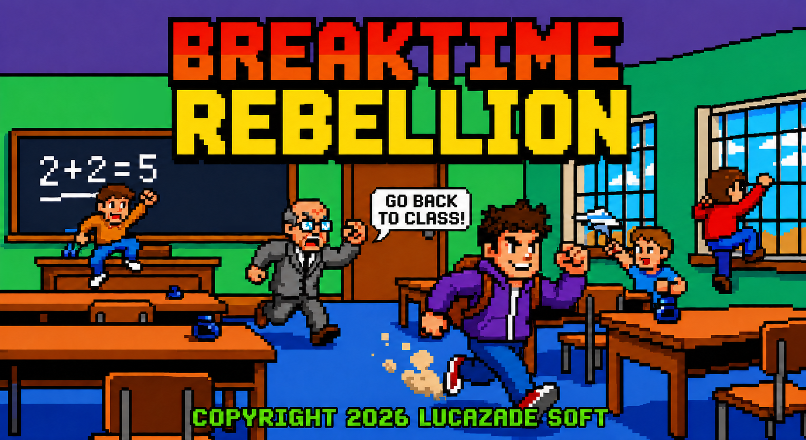
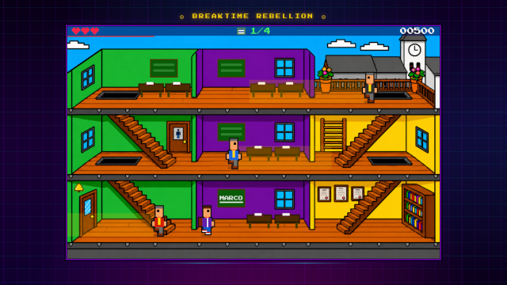
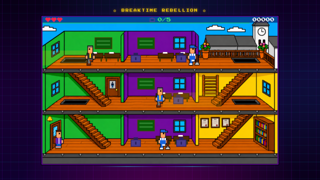

<p align="center">
  
</p>

<p align="center">
  
  
  
  
  
</p>

<p align="center">
  <strong>An arcade game set in an high school of the '80s/'90s.</strong><br>
  Inspired by the classic <em>Skool Daze (1984)</em> — cause chaos, dodge teachers, don't get caught.
</p>

---

## Screenshots

<p align="center">
  
  &nbsp;
  
</p>

---

## About

**Breaktime Rebellion** is a 2D pixel-art arcade game for Android and browser. You play as **Marco**, a student who must pull off increasingly daring acts of classroom chaos — tagging chalkboards, stealing bags, flooding the bathroom, planting firecrackers — while avoiding the roaming teachers, the janitor, and the school principal.

Ten levels. Ten missions. One legendary school year.

- 🏫 3-floor school with oblique-perspective bitmap background
- 👨‍🏫 Multiple NPCs with patrol AI and line-of-sight detection
- 📱 Playable on Android (PWA / Capacitor APK) and desktop browser
- 🎮 Analog joystick overlay for mobile, keyboard for desktop
- 🌍 English / Italian — auto-detected from browser locale

---

## The Story

> *One Linux sysadmin, no budget, one month, and a virtual AI team. A game that actually ships.*

Breaktime Rebellion was built entirely in **May 2026** by Luca Forina as a personal project, with an AI virtual team handling every creative and technical role:

| Role | Tool |
|---|---|
| Code (100%) | **Claude** (Anthropic) via Claude Code |
| Game art & backgrounds | **ChatGPT** (OpenAI) + **GIMP** |
| UI prototyping | **Claude** (via artifacts) |

No game engine. No framework. Just HTML5 Canvas, vanilla JavaScript, and a lot of prompting.

The project started from a late-night chat session about retro games — one month later, ten levels were done and the APK was on the phone.

---

## How to Play

### Controls

| Input | Action |
|---|---|
| `← →` | Move Marco |
| `↑ / ↓` | Enter diagonal staircases |
| `Z` or `Space` | Action (spray, collect, interact) |
| `C` | Credits |
| `P` | Pause |
| `Esc` | Back to main menu |

**On mobile:** drag the on-screen joystick (bottom-left) and tap the action button (bottom-right).

**Staircases:** diagonal input required to enter — right staircase needs `↑ + →` to go up; left staircase needs `↑ + ←`.

### The Levels

| # | Mission |
|---|---|
| L1 | Tag all chalkboards |
| L2 | Steal your classmates' bags |
| L3 | Smash the vending machines |
| L4 | Deflate the gym ball |
| L5 | Throw paper balls at seated students |
| L6 | Knock books off the shelf (the Principal is watching) |
| L7 | Flood the bathroom |
| L8 | Plant firecrackers in the bins |
| L9 | Trigger the fire sprinklers |
| L10 | **Steal the class register and escape** — night mode, guards, your friend Luca waits at the door |

---

## Play It

### Browser (PWA)

Open the game in Chrome on Android → tap **Add to Home Screen** → install as a fullscreen app.

### Android APK

Download the latest APK from [Releases](https://github.com/lucazade/breaktime-rebellion/releases) and install directly.

---

## Tech Stack

| Component | Technology |
|---|---|
| Rendering | HTML5 Canvas — 1600×1000 (scale 5×), logical coordinates 320×200 |
| Language | Vanilla JavaScript (no framework, no bundler) |
| Font | Press Start 2P (self-hosted) |
| Colours | Custom flat palette — `const PAL`, ~200 named entries |
| Audio | MP3/WAV/OGG via custom `GameAudio` manager |
| PWA | `manifest.json` + service worker |
| Android | [Capacitor](https://capacitorjs.com/) |

The codebase is split into focused modules loaded in a strict dependency order:

```
config.js → palette.js → scene.js → ui.js
draw-chars.js → draw-objects.js → levels.js → i18n.js
audio.js → state.js → input.js → physics.js
entities.js → draw-game.js → draw-title.js → draw-hud.js
draw-overlays.js → menus.js → game.js → title.js
```

---

## Contributing

The repository is open for contributions. If you find a bug or want to suggest an improvement:

1. Fork the repository
2. Create a feature branch: `git checkout -b fix/your-fix`
3. Run the JS validation before committing:
   ```bash
   node -e "
   const fs=require('fs');
   const files=['js/config.js','js/palette.js','js/scene.js','js/ui.js','js/draw-chars.js','js/draw-objects.js','js/levels.js','js/i18n.js','js/audio.js','js/state.js','js/input.js','js/physics.js','js/entities.js','js/draw-game.js','js/draw-title.js','js/draw-hud.js','js/draw-overlays.js','js/menus.js','js/game.js','js/title.js'];
   const src=files.map(f=>fs.readFileSync(f,'utf8')).join('\n');
   try{new Function(src);console.log('JS OK');}catch(e){console.log('ERROR:',e.message);}
   "
   ```
4. Open a Pull Request with a clear description

Commit message convention: `feat:`, `fix:`, `refactor:`, `chore:`, `docs:`

---

## Credits

| | |
|---|---|
| **Design & Development** | [Luca Forina](https://github.com/lucazade) — Lucazade Soft |
| **AI Developer** | [Claude](https://claude.ai) by Anthropic — 100% of the code |
| **Game Art** | [ChatGPT](https://chat.openai.com) by OpenAI + [GIMP](https://gimp.org) |
| **UI Prototyping** | [Claude](https://claude.ai) (artifact mode) |
| **Inspired by** | [Skool Daze](https://en.wikipedia.org/wiki/Skool_Daze) (1984, David Reidy / Microsphere) |

---

## Support

If you enjoyed the game, consider buying me a coffee ☕

[](https://ko-fi.com/lucaforina)

---

## License

MIT © 2026 Luca Forina — [LICENSE](LICENSE)

> Game assets (background art, logo) generated with AI tools (ChatGPT) for this project.
